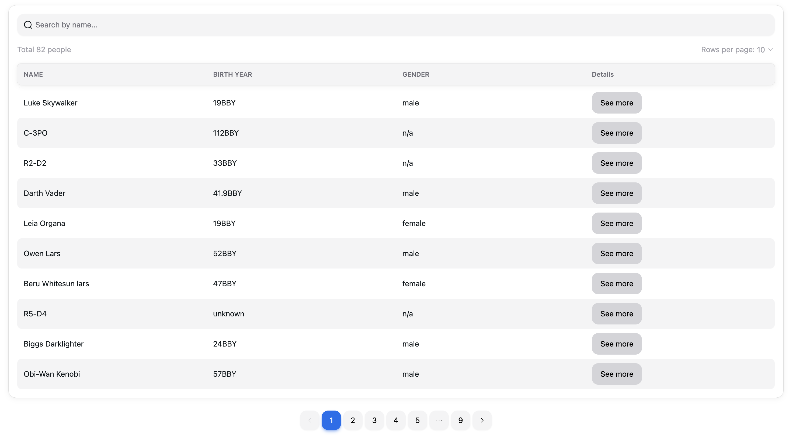

# STAR WARS characters library app [[live_application]](https://react-graphql-list-app.vercel.app/) 
[](https://react-graphql-list-app.vercel.app/)

- Styles: [Tailwind](https://tailwindcss.com/) + [NextUI](https://nextui.org/) (accessibility ready)
- Router: [@tanstack/react-router](https://tanstack.com/router/latest) file based routing
- Data fetching: [@tanstack/react-query](https://tanstack.com/query/latest) + GraphQL client [graphql-request](https://github.com/jasonkuhrt/graphql-request)
- Unit testing: [Vitest](https://vitest.dev/)
- e2e testing: [Playwright](https://playwright.dev/)

## Getting Started

First, run the development server:

```bash
npm run dev
# or
yarn dev
# or
pnpm dev
# or
bun dev
```

Dev server is running on http://localhost:3001/

## Tests

```bash
npm run test
```

### ROADMAP
- [x] [general] Implement general app functionality based on tech stack above: routing/graphQL client/query caching/testing
- [x] [experiments] In /people and /people/$peopleId routes used different @tanstack/query + @tanstack/router methods to retrieve data from cache
- [x] [reliability] Add zod to validate data from API in runtime
- [x] [deploy] Run hosted project
- [x] [testing] Add playwright e2e tests to verify app routing behavior
- [x] [CI] add GitHub CI for e2e testing
- [ ] [performance] add Zustand for state management
- [ ] [testing] Add unit tests for hooks
- [ ] [performance] Improve requests caching
- [ ] [UX] Improve error handling for some cases
- [ ] [performance] Fetch data dynamically (per_page) + offset based on graphQL params
- [ ] [UX] Improve pages loading states, replace default spinners with skeleton pattern for Person page
- [ ] [UI] Improve responsiveness for screens lower than 576px
- [ ] [performance] Add code-splitting

### KNOWN ISSUES

- [x] [routing] Vercel drops app on page update without correct vercel.json route config
- [ ] [UI] Pagination shift on the last page
