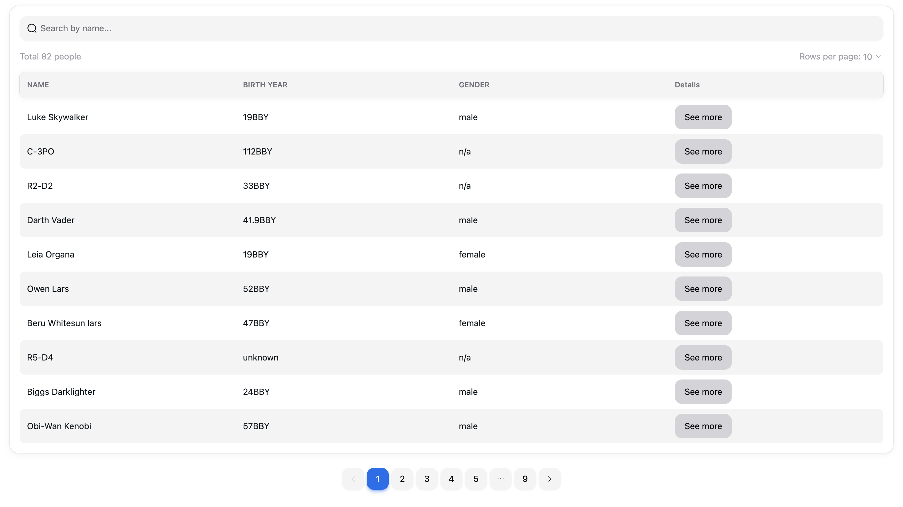
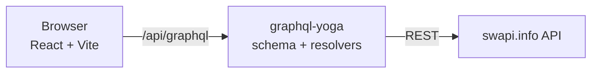
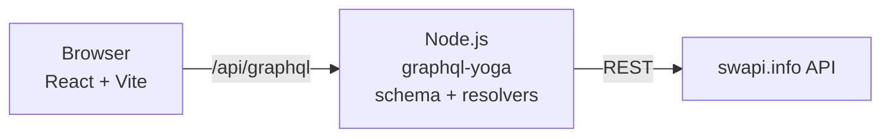
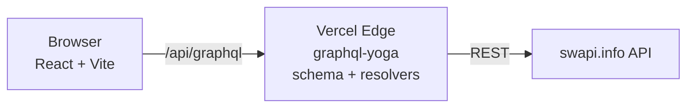

# STAR WARS characters library app [[live_application]](https://react-graphql-list-app.vercel.app/) 

[](https://react-graphql-list-app.vercel.app/)

- Styles: [Tailwind](https://tailwindcss.com/) + [HeroUI](https://heroui.com/) (accessibility ready)
- Router: [@tanstack/react-router](https://tanstack.com/router/latest) file based routing
- Data fetching: [@tanstack/react-query](https://tanstack.com/query/latest) + GraphQL client [graphql-request](https://github.com/jasonkuhrt/graphql-request)
- GraphQL server: [graphql-yoga](https://the-guild.dev/graphql/yoga-server) with custom schema + resolvers over `swapi.info`
- e2e testing: [Playwright](https://playwright.dev/)

## Architecture

The app uses a custom GraphQL API implemented with a **GraphQL schema and resolvers** (`api/schema.ts`) and served by **graphql-yoga** (`api/graphql.ts`). It acts as a stable wrapper over the [`swapi.info`](https://swapi.info) REST API.


```mermaid
graph LR
    A[Browser<br/>React + Vite] -->|/api/graphql| B[graphql-yoga<br/>schema + resolvers]
    B -->|REST| C[swapi.info API]
```

Local development runs graphql-yoga as a standalone server (Node.js). In production, it is deployed as a **Vercel Edge Runtime Serverless Function**.

This avoids the instability of public SWAPI GraphQL wrappers (all of which returned `null` for the most of fields as of July 2026). `swapi.info` was chosen as the REST source because it:

- Returns all 82 characters with full data in a **single request** (no pagination)
- Is actively maintained and open-source

## Getting Started

There are two ways to run locally:

### Option 1 — Single command (recommended)

Starts both the local GraphQL server and the Vite dev server together.

```bash
npm run dev:all
```

Frontend: http://localhost:3001/
GraphQL server: http://localhost:4000/graphql


```mermaid
graph LR
    L1[Browser<br/>React + Vite] -->|/api/graphql| L2[Node.js<br/>graphql-yoga<br/>schema + resolvers]
    L2 -->|REST| L3[swapi.info API]
```

### Option 2 — Vercel CLI (full production-like environment)

Uses `vercel dev` to run the frontend and the Vercel serverless function (`api/graphql.ts`) together, exactly as they would in production.

```bash
npm i -g vercel
npm run dev:vercel
```

Frontend + API: http://localhost:3001/
GraphQL endpoint: http://localhost:3001/api/graphql


```mermaid
graph LR
    P1[Browser<br/>React + Vite] -->|/api/graphql| P2[Vercel Edge<br/>graphql-yoga<br/>schema + resolvers]
    P2 -->|REST| P3[swapi.info API]
```

## Tests

```bash
npm run test:e2e
```

### ROADMAP

- [x] [general] Implement general app functionality based on tech stack above: routing/graphQL client/query caching/testing
- [x] [experiments] In /people and /people/$peopleId routes used different @tanstack/query + @tanstack/router methods to retrieve data from cache
- [x] [reliability] Add zod to validate data from API in runtime
- [x] [deploy] Run hosted project
- [x] [testing] Add playwright e2e tests to verify app routing behavior
- [x] [CI] add GitHub CI for e2e testing
- [x] [performance] Improve requests caching
- [x] [UX] Improve error handling for some cases
- [x] [performance] Fetch data dynamically (per_page) + offset based on graphQL params
- [x] [UX] Improve pages loading states, replace default spinners with skeleton pattern for Person page
- [x] [UI] Improve responsiveness for screens lower than 576px
- [x] [performance] Add code-splitting

### KNOWN ISSUES

- [x] [routing] Vercel drops app on page update without correct vercel.json route config
- [x] [UI] Pagination shift on the last page
